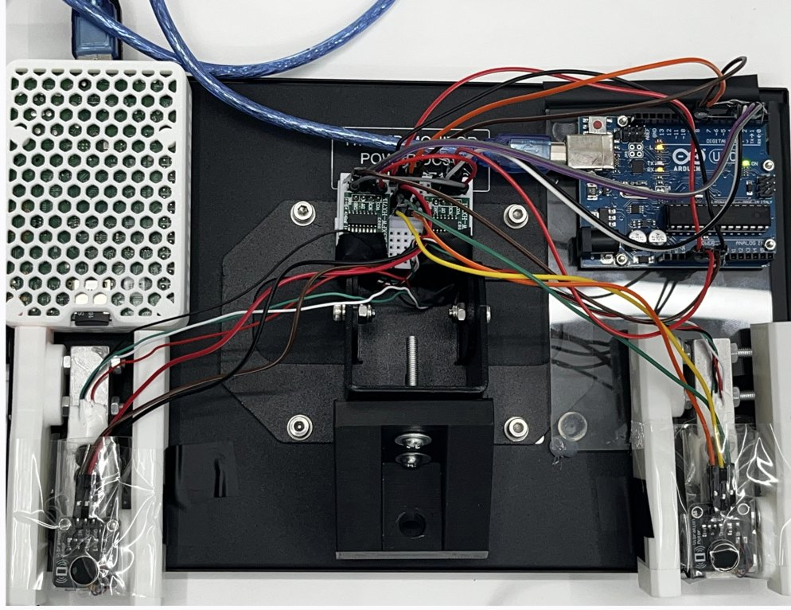
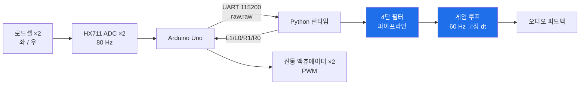
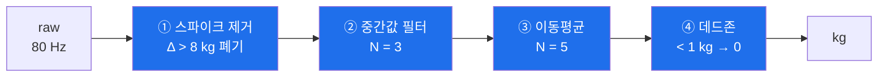

<div align="center">

# 악력 재활 시스템

**로드셀에서 읽은 힘을 실시간 신호처리로 다듬어, 게임과 소리로 되돌려주는 재활 시스템**

[](https://www.python.org/)
[](https://www.arduino.cc/)
[](https://www.raspberrypi.com/)
[](#-신호처리-파이프라인)
[](#-실행-구조-producer--consumer)

단국대학교 임베디드 시스템 과제 · 2인 팀 · 2026.04 ~ 2026.07

</div>

<div align="center">

<a href="https://www.youtube.com/watch?v=_I-ejlEAkNM">

</a>

<sub>데모 영상 — 로드셀을 쥐는 힘이 그대로 게임 입력이 된다 &nbsp;·&nbsp; 이미지를 누르면 영상이 열린다</sub>

<br><br>


<br><sub>가운데 로드셀 마운트(3D 모델링·출력), 우측 상단 아두이노 우노, 그 아래 HX711 증폭 모듈.<br>좌우 진동 모터는 전류 부하 때문에 트랜지스터 구동으로 회로를 바꿨다</sub>

</div>

---

## 한눈에 보기

| | |
|---|---|
| **문제** | 악력 재활 훈련은 반복적이고 지루해서 지속률이 낮다 |
| **접근** | 양손 악력을 실시간으로 읽어 **게임 조작과 소리**로 되돌려준다 |
| **엔지니어링 초점** | 로드셀 원신호는 **노이즈와 스파이크로 그대로 쓸 수 없다.** 이걸 게임 입력으로 쓸 수 있는 신호로 만드는 것이 핵심 |
| **핵심 설계** | ① 4단 필터 파이프라인 ② 센서 3종 추상화 ③ Producer–Consumer 60 Hz 루프 |
| **결과** | 재활 게임 3종 + 악력 신디사이저 1종, 런처까지 손만으로 조작 |

> 이 저장소는 "게임 4개"가 아니라 **"센서 신호를 실시간 제어 입력으로 만드는 파이프라인"**에 관한 것이다.
> 게임은 그 파이프라인을 검증하는 응용이다.

---

## 목차

1. [왜 신호처리가 핵심인가](#1-왜-신호처리가-핵심인가)
2. [시스템 구성](#2-시스템-구성)
3. [신호처리 파이프라인](#3-신호처리-파이프라인)
4. [센서 3종 추상화](#4-센서-3종-추상화)
5. [실행 구조 (Producer–Consumer)](#5-실행-구조-producerconsumer)
6. [하드웨어](#6-하드웨어)
7. [응용 — 게임 3종 + 신디사이저](#7-응용--게임-3종--신디사이저)
8. [캘리브레이션](#8-캘리브레이션)
9. [실행 방법](#9-실행-방법)
10. [겪은 문제와 해결](#10-겪은-문제와-해결)

---

## 1. 왜 신호처리가 핵심인가

HX711 로드셀은 80 Hz로 값을 뱉지만, 그 원신호는 **게임 입력으로 바로 쓸 수 없다.**

- 손이 닿는 순간 **수십 kg짜리 스파이크**가 튄다
- 힘을 유지해도 값이 **미세하게 계속 진동**한다
- 손을 뗀 상태에서도 **0이 아니라 1 kg 근처를 떠돈다**

이 상태로 게임에 연결하면 캐릭터가 떨리고, 의도하지 않은 입력이 들어가고, 손을 뗐는데도 조작이 계속된다. **재활 대상자가 쓰는 시스템에서 이건 곧 사용 불가를 의미한다.**

그래서 이 프로젝트의 실제 과제는 게임을 만드는 것이 아니라, **원신호를 신뢰할 수 있는 제어 입력으로 바꾸는 것**이었다.

---

## 2. 시스템 구성



**양방향 통신**이다. 센서 값을 받기만 하는 게 아니라, 게임 이벤트(두더지 명중, 벽 충돌)가 발생하면 진동 명령을 되돌려 보낸다.

---

## 3. 신호처리 파이프라인

원신호 → 제어 입력까지 4단계.



| 단계 | 파라미터 | 잡아내는 문제 |
|---|---|---|
| ① **스파이크 제거** | 이전 값 대비 **8 kg** 이상 급변 시 폐기 | 손이 닿는 순간의 순간 피크, 케이블 흔들림 |
| ② **중간값 필터** | 윈도우 **3** | 산발적 이상치. 평균과 달리 이상치에 끌려가지 않음 |
| ③ **이동평균** | 윈도우 **5** | 유지 구간의 미세 진동 |
| ④ **데드존** | **1 kg** 미만 → 0 | 손을 뗀 상태의 잔류값. "안 쥐고 있음"을 확실히 0으로 |

**순서가 설계 지점이다.** 스파이크를 먼저 버리지 않으면 중간값·이동평균 윈도우가 오염되고, 데드존을 먼저 적용하면 스파이크가 그대로 통과한다.

구현: [`common/sensor.py`](common/sensor.py)

---

## 4. 센서 3종 추상화

`GripSensor` 추상 인터페이스 하나에 구현 3개를 두었다.

| 구현 | 입력원 | 용도 |
|---|---|---|
| `MockGripSensor` | **키보드** (A/S 왼손, K/L 오른손) | **하드웨어 없이 게임 로직 개발·테스트** |
| `ArduinoGripSensor` | USB 시리얼 `raw,raw` | 일반 PC + Arduino |
| `RealGripSensor` | Raspberry Pi GPIO 직결 | 최종 배포 형태 |

**Mock 구현이 실용적으로 가장 중요했다.** 로드셀·Arduino가 없는 자리에서도 게임 로직과 렌더링을 그대로 개발할 수 있었고, 하드웨어 문제와 소프트웨어 문제를 분리해서 디버깅할 수 있었다.

Mock은 단순 키 입력이 아니라 실제 악력의 거동을 흉내 낸다 — 누르고 있으면 **9 kg/s로 차오르고**, 떼면 **8 kg/s로 감소**한다.

게임 코드는 어느 구현이 붙어 있는지 알지 못한다. 실행 플래그(`--arduino` / `--real` / 없음)만 바꾸면 된다.

---

## 5. 실행 구조 (Producer–Consumer)

센서는 **80 Hz**, 게임 루프는 **60 Hz**다. 주기가 다르고, 시리얼 읽기는 블로킹이다.

```
[센서 스레드]  시리얼 read → 필터 → Queue.put()      80 Hz
                                   │
[메인 스레드]  Queue.get_nowait() → 게임 로직 → 렌더  60 Hz 고정 dt
```

메인 루프에서 직접 시리얼을 읽으면 **읽기 지연이 그대로 프레임 드롭**이 된다. 센서 읽기를 별도 스레드로 분리하고 큐로 넘겨, 게임 루프가 센서 상태와 무관하게 일정한 dt를 유지하도록 했다.

고정 dt를 쓴 이유는, 물리 계산(풍선 팽창 속도, 우주선 관성)이 프레임 레이트에 따라 달라지면 **같은 힘을 줘도 기기마다 다르게 동작**하기 때문이다.

---

## 6. 하드웨어

### 배선

| 신호 | 왼손 | 오른손 |
|---|---|---|
| HX711 DOUT | D2 | D4 |
| HX711 SCK | D3 | D5 |
| 진동 액츄에이터 | D9 (PWM) | D10 (PWM) |

Raspberry Pi 직결 시 (BCM): DOUT `GPIO 5` / `GPIO 13`, SCK `GPIO 6` / `GPIO 19`

### 시리얼 프로토콜

직접 설계한 최소 프로토콜이다.

```
Arduino → PC   (10 ms 주기)      285400,291820\n     좌 raw, 우 raw
PC → Arduino   (이벤트 발생 시)   L1 / L0 / R1 / R0    좌우 진동 ON/OFF
```

파싱 비용을 줄이기 위해 고정 포맷 한 줄로 유지했고, 진동 명령은 상태 토글 방식이라 게임 쪽에서 타이머를 관리하지 않아도 된다.

### 3D 프린팅 마운트

로드셀을 손으로 쥘 수 있는 형태로 고정하기 위해 직접 모델링·출력했다.

| 파일 | 설명 |
|---|---|
| [`models/Base_1.stl`](models/Base_1.stl) | 센서 고정 베이스 |
| [`models/HX711_Load_Cell--Foot.stl`](models/HX711_Load_Cell--Foot.stl) | 로드셀 발판 |

---

## 7. 응용 — 게임 3종 + 신디사이저

파이프라인이 제대로 동작하는지는 **서로 다른 성격의 입력 요구**로 검증했다.

| 응용 | 요구하는 입력 특성 | 검증하는 것 |
|---|---|---|
| **풍선 키우기** | 목표값(≈15 kg)을 3초간 **유지** | 정상 상태의 안정성 — 진동이 남으면 유지 판정이 깨진다 |
| **두더지 잡기** | 짧고 강한 **순간 입력** | 응답 지연 — 필터가 과하면 반응이 늦어진다 |
| **우주 조종** | 양손 **차이값**으로 연속 조향 | 좌우 채널의 균형 — 한쪽만 편향되면 계속 휜다 |
| **악력 신디사이저** | 힘 → **연속적인 소리** | 미세 변화 해상도 — 떨림이 그대로 음정 흔들림이 된다 |

**신디사이저가 가장 가혹한 검증이었다.** 시각 피드백은 약간의 떨림을 눈치채기 어렵지만, 소리는 즉시 드러난다. 왼손이 볼륨(0.5~15 kg), 오른손이 주파수(2.3 kg → 220 Hz ~ 10 kg → 600 Hz, 로그 스케일)를 맡고, 기본파 + 2배음 + 3배음을 합성해 `aplay`로 끊김 없이 PCM 스트리밍한다.

**런처도 손으로 조작한다** — 왼손 0.3초 유지로 커서 왼쪽, 오른손으로 오른쪽, 양손 유지로 선택. 키보드 없이 시스템 전체를 쓸 수 있어야 재활 도구로 성립한다.

모든 게임 공통 종료 제스처: **양손 더블 펌프**(2초 내 2번 힘껏)

---

## 8. 캘리브레이션

로드셀은 개체마다 스케일이 다르고, 조립 상태에 따라 영점이 달라진다. 매번 손으로 맞출 수 없으므로 자동화했다.

**Arduino 모드 — 자동** (첫 실행 시)
```
1. 영점(Tare) 3초   손을 떼세요
2. 최대 악력 5초    최대한 세게 쥐세요
3. common/calibration.json 저장 → 이후 실행부터 재사용
```

**Raspberry Pi 직결 — 수동** ([`games/balloon_game/calibrate.py`](games/balloon_game/calibrate.py))
알고 있는 무게를 올려 스케일 팩터를 계산한다.

---

## 9. 실행 방법

```bash
python3 -m venv venv && source venv/bin/activate
pip install -r requirements.txt
```

Raspberry Pi에서 HX711 직결 시: `sudo apt-get install python3-dev alsa-utils && pip install hx711`

**런처** (전체 진입점)
```bash
cd games
DISPLAY=:0 python3 launcher.py --arduino   # Arduino USB
DISPLAY=:0 python3 launcher.py --real      # Pi HX711 직결
```

**개별 게임** — 3가지 모드 공통
```bash
python3 main.py            # Mock — 센서 없이 키보드로 (A/S 왼손, K/L 오른손)
python3 main.py --arduino  # Arduino USB 포트 자동 감지
python3 main.py --real     # Raspberry Pi GPIO 직결
```

**디버그 — 시리얼 모니터**
```bash
python3 measure/main.py    # 1/2 왼쪽 진동, 3/4 오른쪽 진동, q 종료
```

---

## 10. 겪은 문제와 해결

**진동 모터를 켜면 오른손 센서 값이 끊긴다**
진동 액츄에이터를 GPIO에 직결했더니 순간 전류가 몰려 HX711 읽기가 불안정해졌다. **NPN 트랜지스터(2N2222)를 통해 구동**하도록 회로를 바꿔 해결했다. 소프트웨어 문제로 보였지만 원인은 전원이었다.

**필터를 강하게 걸면 반응이 느려진다**
이동평균 윈도우를 키우면 신호는 매끄러워지지만 두더지 잡기의 반응속도가 떨어진다. **윈도우 3(중간값) + 5(이동평균)** 조합이 안정성과 지연 사이의 균형점이었다.

**포트 충돌**
Arduino IDE 시리얼 모니터가 열려 있으면 Python이 포트를 잡지 못한다. 포트 자동 감지를 넣되, 실패 시 원인을 명시하도록 했다.
포트 확인: macOS `ls /dev/cu.*` · Linux `ls /dev/ttyUSB*` `ls /dev/ttyACM*`

---

## 저장소 구조

```
├── sketch_jun11a.ino          # Arduino 펌웨어 (HX711 읽기 + 진동 제어)
├── common/                    # ★ 공용 계층
│   ├── sensor.py              #   GripSensor 추상화 + 필터 파이프라인
│   ├── sfx.py                 #   절차적 효과음 (numpy 합성)
│   └── fonts.py
├── games/
│   ├── launcher.py            #   메인 진입점 (악력으로 조작)
│   ├── balloon_game/          #   main / game_logic / renderer / calibrate
│   ├── Whack-A-Mole/          #   main / game_logic / renderer
│   ├── steering_game/         #   main / game_logic / renderer
│   └── synthesizer/           #   main / audio_engine / renderer
├── measure/main.py            # 시리얼 모니터 (디버그)
└── models/*.stl               # 3D 프린팅 마운트
```

`common/`에 하드웨어 접근과 신호처리를 한 벌만 두고, 그 위에 응용을 올리는 구조다. 센서 프로토콜이나 필터가 바뀌어도 `common/` 한 곳만 고치면 전체에 반영된다. 각 응용은 `main` / `game_logic` / `renderer`로 동일하게 분리했다.

---

<div align="center">

**이종하** · [GitHub](https://github.com/bell-ha) · [Portfolio](https://bell-ha.github.io)

</div>
